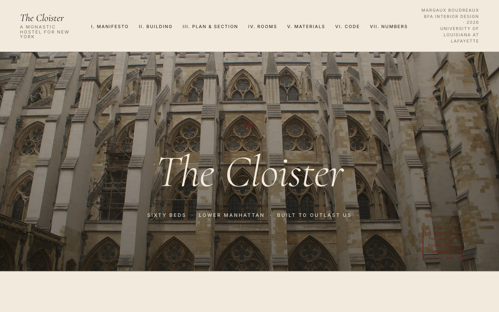

# The Cloister

> _A monastic hostel for New York._

A portfolio mock-up by **Margaux Boudreaux**, BFA Interior Design '26, University of Louisiana at Lafayette. A 60-bed transient hostel in Lower Manhattan that fuses three typologies — the lobby of an Ace Hotel, the discipline of a Catholic church, and the economy of a hostel — into one building, designed to outlast its parishioners and priced for the young traveler.

**Live site:** https://trevthefoolish.github.io/cloister-nyc/



## What this is

A single-page, hand-built editorial portfolio site documenting the brief, the building, the rooms, the materials, and the NYC code compliance position for the project. Static HTML/CSS/JavaScript only — no frameworks, no build step, no dependencies.

The brief is fictional. The construction logic, code citations, and materials specifications are not.

## Sections

1. **Manifesto** — three columns: hotel, church, hostel
2. **The Building** — the 1,000-year construction logic
3. **Plan & Section** — axonometric, typical floor plan, long section (all hand-authored SVG)
4. **The Rooms** — six programs: bunk, cell, suite, refectory, common house, bath house
5. **Materials** — six samples, each with origin, lifespan, and repairability spec
6. **Code & Conscience** — fourteen-line NYC Construction Code compliance brief
7. **The Numbers** — pricing schedule from the $55 cloister bunk to the $245 suite
8. **Colophon**

## Run locally

```bash
git clone https://github.com/trevthefoolish/cloister-nyc.git
cd cloister-nyc
python3 -m http.server 8000
open http://127.0.0.1:8000/
```

No build step. No package manager. Open `index.html` directly if you don't need the JSON-fed sections to render (those need an HTTP server because of `fetch`).

## Type & Color

| | |
|---|---|
| Display serif | Cormorant Garamond (italic) |
| Body serif | Cardo |
| Sans (UI) | Inter, tracked +0.18em uppercase |
| Specifications | JetBrains Mono |
| Parchment | `#F2EBDD` |
| Cream alt | `#E8DDC7` |
| Ink | `#1B1A17` |
| Body text | `#3B362E` |
| Hairline rule | `#C9BEA8` |
| Oxblood (accent) | `#6B1F1A` |
| Brass | `#A87A2C` |
| Moss (the chapel) | `#3F4A36` |

## File structure

```
cloister-nyc/
├── index.html          # the page
├── styles.css          # all styling
├── app.js              # smooth scroll + lightbox + JSON renderers
├── data/
│   ├── program.json    # six rooms (bunk, cell, suite, refectory, common house, bath house)
│   ├── materials.json  # six materials (limestone, oak, brass, plaster, terrazzo, linen)
│   └── code.json       # NYC code compliance brief + numbers schedule
├── drawings/
│   ├── axon.svg        # cutaway axonometric, hand-authored
│   ├── floorplan.svg   # typical sleeping floor
│   └── section.svg     # long building section
├── images/             # reference photographs (Wikimedia Commons, public-domain or CC)
├── SPEC.md             # the original brief
├── README.md
└── LICENSE             # MIT
```

## Image credits

Reference photographs are sourced from Wikimedia Commons under their respective open licences (mostly CC-BY-SA or public domain) and stand in for the renderings a finished portfolio would commission. They are illustrative — not a claim that any particular building is The Cloister.

## License

MIT. See `LICENSE`.

---

_Set in Cormorant Garamond, Cardo, and Inter. Specifications in JetBrains Mono. MMXXVI._
